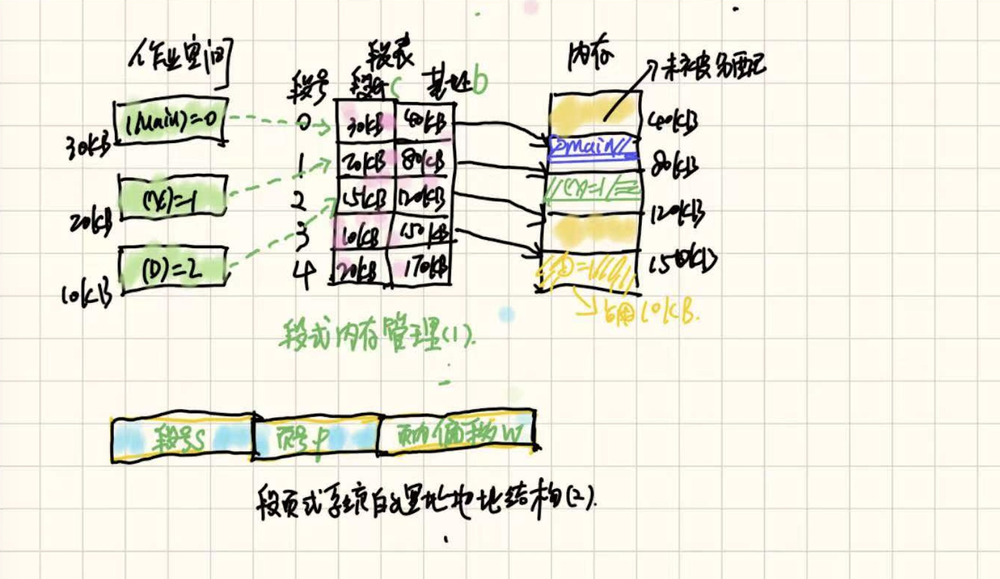

# 操作系统-精髓与设计原理

> 操作系统利用一个或多个处理器的硬件资源，为系统用户提供一组服务，它还代表用户来管理辅助存储器和输入输出（`Input/Output, IO`）设备。因此，从最顶层看，一台计算机由处理器、存储器和输入/输出部件组成，每类部件都有一个或者多个模块。这些部件以某种方式互联，以实现计算机执行程序的主要功能。

主要探讨了操作系统中关于`memory`管理、淘汰算法及虚拟内存机制、线程和进程内容（并发控制）：

1. [进程的描述和控制](./threads-smp-microkernels.md)部分
2. [线程、对称多处理(`SMP`)和微内核](./threads-smp-microkernels.md)
3. [并发性：互斥和同步](./concurrency:Mutual-exclusion-and-synchronization.md)
4. [内存管理](./memory-management.md)内容
5. [虚拟内存设计](./virtual-memory.md)
6. [多处理器和实时调度](./multiprocessor-and-realtime-scheduling.md)
7. [并发：死锁和饥饿](./concurrency:deadlock-and-starvation.md)

## 一、进程管理
2021.下列操作中，操作系统在创建新进程时，必须完成的是（a，b）。a.申请空白的进程控制块  b.初始化进程控制块  c.设置金策红状态为执行态。
> Note: 进程的创建步骤为：申请一个空白的`PCB`（进程控制块）、为新进程分配资源（程序、数据及用户栈分配必要的内存）、初始化`PCB`块以及将新进程插入到就绪队列。

2021.对于"中断处理结束"、"进程阻塞"、"进程执行结束"和"进程时间片用完"的操作，会引起进程调度程序的执行。此外，常考察进程状态的转换，分时系统`CPU`时间片用完或主动出让`CPU`，线程会由执行态转换为就绪态。用户级线程完全由用户管理，多线程模型的多对一模式，当一个线程使用内核服务时被阻塞，则整个进程都会被阻塞。

死锁产生的必要条件有：a.互斥条件、b.不剥夺条件、c.请求保持条件、d.循环等待条件，死锁的处理策略有死锁预防、避免死锁和死锁的检测及解除。对于死锁避免，常会考察安全序列和银行家算法。

2020.系统中有`A`、`B`类资源各`6`个，`t`时刻资源分配及需求情况如表所示。计算安全序列时，会涉及资源相关矩阵如`Need`=`Max`-`Allocated`，`Need`矩阵结果为：{(4, 4), (3, 1), (3, 4)} - {(2, 3), (2, 1), (1, 2)} = {(2 1), (1， 0), (2，2)}。

进程  | A已分配数量 | B已分配数量 | A需求总量    | B需求总量 |
---- | --------- | ----------| ----------|---------| 
P1     |        2         |      3           |       4          |       4        | 
P2    |        2         |       1           |       3          |       1        | 
P3    |        1          |      2           |       3          |       4        | 

`A`、`B`各类资源各`6`个，除去`3`个进程已分配的资源，还剩`A`、`B`为(1, 0)，故只有`P2`满足条件，分配给`P2`其执行完成后，`A`、`B`的资源为(3, 1)。此时满足`P1`的要求，分配给`P1`。等其执行完成后，最后将所有资源分配给`P3`，最后构成安全序列为（P1，P2，P3）。

进程调度的指标，周转时间：指作业从提交到作业完成所经历的时间，包含作业等待、在就绪队列中排队、在处理机上运行等操作花费时间的总和，周转时间=作业完成时间 - 作业提交时间。平均周转时间指多个作业周转时间的平均数值，平均周转时间=（作业1周转时间 + .... + 作业n周转时间）/n，带权周转时间指作业周转时间与作业实际运行时间的比值，带权周转时间=作业周转时间/作业实际运行时间。

2019.系统采用二级反馈队列调度，队列Q1采用时间片轮转算法，时间片为`10`ms；就绪队列Q2采用短进程优先调度算法，系统优先调度Q1队列的进程，当Q1为空时才会调度Q2的进程，系统依次创建P1，P2后即开始进行调度，P1、P2需要的`CPU`时间分别为`30`ms和`20`ms，则其平均等待时间为（15ms）
> Note: 多级反馈队列调度，Q1通常为时间片轮询调度，若进程在`1`个时间片执行不完，则会将其放入Q2中进行调度。P1执行时间为 = Q1执行10ms + Q2等待10ms + Q2中等待P2执行10ms(SJF) + 自己执行20ms = 50ms，P2执行时间为 = Q1等待P1执行10ms + Q1自己执行10ms + Q2自己执行10ms = 30ms。平均等待时间为 = (10ms+10ms+10ms) / 2 = 15ms。	

信号量同步`P`操作和`V`操作，`wait(S)`和`signal(S)`访问。利用信号量实现进程间资源同步，`P1`和`P2`执行具有依赖关系，则`P1`中处理完后调用`V(S)`、`P2`在执行过程中用`P(S)`等待执行。用`P`和`V`操作实现进程间互斥，对于临界资源可分别用`P`和`V`操作保护。

```
semaphore S=0;      // 初始化信号量
// （同步）实现P1、P2间的同步，只有x执行完后，y语句才可继续执行
P1() { x语句执行; V(s); ... }    P2() { z语句执行; P(S); y语句; }     

// 实现进程P1、P2资源访问互斥特点，在访问临界资源前，都需加锁，仅有一个进程可进入临界区。
P1() { ... P(S);  进程P1的临界区; V(S); }
P2() { ... P(S);  进程P1的临界区; V(S); }
```
利用信号量实现前驱关系，对依赖关系S1->S3，S1->S2，S2->S5，S3->S5设置变量为a, b, c, d，用信号量实现的逻辑如下：

```
semaphore a=b=c=d=0;   // 信号量a, b, c, d分别表示进程间依赖关系
S1() { ...; V(a); V(b); }	  // S1的逻辑执行完后，通过信号量a, b 通知S2、S3可继续执行 
S2() { ...; P(b); V(c); }   // S2处于阻塞状态，直到S1执行完成调用signal(a)变量
S3() { ...; V(a); V(d); }   // S3、S4的逻辑也是同理 
S5() { ...; P(c); P(d); ..; }
```
## 二、内存管理
编译后的程序需经过链接才能装载，而链接后形成的目标程序中的地址也就是逻辑地址：

* 静态重定位特点，要求必须给作业分配全部内存空间，若无法分配则不能装入改作业，此外，作业一旦进入内存，整个运行期间就不能在内存中移动，也不能再申请内存空间。
* 动态重定位，只有在程序真正执行时，才会将逻辑地址转换为绝对地址，这种转换需要一个重定位寄存器的支持。程序运行之前可以只装入它的部分代码，然后在运行期间动态申请分配内存。

基本分页存储管理方式（含二级分页）：


固定分区会产生内部碎片，动态分区会产生外部碎片，都会产生内存碎片。分页的思想，将主存空间划分大小相等且固定的块，块相对较小，作为主存的基本单位。引入二级分页，主要是为了避免页表项太多，占用过多内存空间。

分页存储的几个基本概念，页、地址结构、页表，系统中通常设置一个页表寄存器（PTR），存放页表在内存的起始地址和页表长度，地址转换均是由硬件自动完成：

* 进程中的块称为页（Page），内存中的块称为页框（Page Frame），外存也以同样的单位进行划分，直接称为块（Block）。
* 地址结构包含两部分，前一部分为页号P，后一部分为页内偏移量W，地址长度为32位，地址结构决定了虚拟内存的寻址空间有多大。
* 系统为每个进程建立一张页表，它记录页面在内存中对应的物理块号，页表一般存放在内存中。页表由两部分组成，页号和块号。

若页面大小`L`为`1KB`，页号`2`对应的物理块为`b=8`，计算逻辑地址`A=2500`的对应的物理地址`E`？计算页表页号P = 2500/1k = 2，计算页内偏移W = 2500 % 1k = 452。然后查页表项，页号2对应的物理块为8，起始地址从0开始时，E = 8*1024 + 452 = 8644。

基本分段存储管理方式及段页式：



分页管理方式是从计算机的角度考虑设计，目的是提高内存利用率，分段管理方式的提出则考虑了用户和程序员，以满足编程、信息共享保护。分段内存管理的基本概念：

* 段式管理按用户进程中的自然段划分逻辑空间（主程序、子程序、栈和一段数据等），段内要求连续，段间不要求连续，其逻辑上由段号`S`与段内偏移量`W`两部分组成。
* 逻辑空间与内存空间映射的段表，段表项包括“段号”、“段长”和“本段在主存的始址”。
* 地址变换机构，实现进程从逻辑地址到物理地址变换的功能，在系统中设置段表寄存器，存放段表始址`F`和段表长度`M`。

2021.在采用二级页表的分页系统中，`CPU`页表基址寄存器中的内容是当前进程的一级页表的起始物理地址（页表在内存中的首地址）。对于动态分区分配算法，最容易产生内存碎片的是最佳适应算法。

段的共享与保护，段的共享是通过两个段表中相应表项指向相同段来实现的，当一个作业正从共享段中读数据时，必须防止另一个作业修改此共享段的数据。页式存储管理可有效提高内存利用率，而分段存储管理能反映程序的逻辑结构、有利于段的共享，段页式的管理方式是将两种分配方式的优点结合起来。

8.(计算) 在某页式管理系统中，假定主存为`64KB`，分成16块，块号为0，1，2，...，15，设某进程有`4`页，其页号为0，1，2，3，被分别装入主存的第9，0，1，14块。问题：1）该进程的总长度是多大？2）写出该进程每页在主存的始址。3）若给出逻辑地址（0，0）（1，72）（2， 1023）（3，99），请计算出相应的内存地址。
> Note：页面大小为（64 / 16）= 4KB，该进程共有`4`页，所以该进程的总长度为4 * 4 = 16KB。页面大小为4KB，因此低`12`位为页内偏移地址；主存分为`16`块，因此内存物理地址的高`4`位为主存块号。在页表中，页号`0`对应第`9`块，因此内存中的始址为：1001 0000 0000 0000（此处为针对页表的计算，不涉及页内偏移）；逻辑地址（1，72）实际对应内存地址（0， 72）= 0000 0000 0100 1000B。

虚拟内存管理基于局部性原理，时间局部性、空间局部性。解释：某数据被访问过，不久后该指令可能再次执行，虚拟存储器具有三个特征：多次性（作业被允许分多次调入）、对换性（作业运行时可换出、换进）、虚拟性（从逻辑上扩充内存的容量），虚拟内存的实现需建立在离散分配的内存管理方式的基础上。

当进程访问的页面不在主存中，且主存中没有可用的空闲帧时，正确的处理顺序为：缺页中断 -> 决定淘汰页 -> 页面调出 -> 页面调入。在页面置换策略中，所有的置换算法都可能产生抖动。`FIFO`算法存在`Belady`现象，虚拟存储器的最大容量由计算机的地址结构决定。

2015.系统为某进程分配了`4`个页框，该进程已访问的页号序列为 2, 0, 2, 9, 3, 4, 2, 8, 2, 4, 8, 4, 5，若进程要访问的下一页页号为`7`，依据`LRU`算法，应淘汰的页号是（2）。可采用便捷法，对页序号从后往前计数，直到数到`4`个不同的数字为止（要淘汰的页）。

2022.下列选项中，不会影响系统缺页率的是（D.页缓冲队列的长度），其中A.页面置换算法、B.工作集的大小、C.进程的数量都是影响因素，算法局部性具有较好的命中率。工作集越大，命中率越高，进程的数量越多，缺页率越高。

## 三、文件管理

软、硬链接文件共享的区别：建立符号链接时，引用计数值直接复制；建立硬链接时，引用计数值加`1`。删除文件时，删除操作对于符号链接是不可见的，当以后再通过符号链接访问时，发现文件不存在，直接删除符号链接；但对于硬链接则不可直接删除，引用计数值减`1`，若值不为`0`，则不能删除此文件，因为还有其它硬链接指向此文件。

2017.若文件`f1`的硬链接为`f2`，两个进程分别打开`f1`和`f2`，获得对应的文件描述符号为`fd1`和`fd2`，则下列叙述中正确的是：a. f1和f2共享同一个内存索引节点 b. fd1和fd2分别指向各自的用户打开文件表中的一项。


文件保护通过口令保护、加密保护和访问控制等方式实现。2014. 在一个文件被用户进程首次打开的过程中，操作系统需做的是将文件控制块（`FCB`）读到内存中。2013. 用户在删除某文件的过程中，操作系统不可能执行的操作是：a.删除此文件所在的目录，此文件所在的目录存在其它文件时，是不能进行删除的。

文件分配对应于文件的物理结构，是指如何为文件分配磁盘块，常见的磁盘空间分配方法有三种：连续分配、链接分配和索引分配：

*  连续分配要求每个文件在磁盘上占有一组连续的块，连续分配可用第一块的磁盘地址和连续块的数量来定义，一个文件的目录条目包括开始块的地址和此区域的长度。
*  链接分配采取离散分配的方式，消除了外部碎片，显著提高了磁盘空间的利用率，链接分配又可以分配隐式链接和显式链接两种形式。
*  索引分配解决了链接分配不能有效支持直接访问的问题，它将每个文件的所有的磁盘块号集中放在一起构成索引块（表），索引块的第`i`个条目指向文件的第`i`个块。同时，支持多层索引和混合索引。

文件存储空间管理-位示图法，磁盘上所有的盘块都有一个二进制位与之对应。当其值为`0`时，表示对应的盘块空闲。当其值为`1`时，表示对应的盘块已分配，盘块号转换成位示图中的行号和列号：
```
i = (b-1) DIV n + 1
j = (b-1) MOD n + 1
```

磁盘调度算法，一次磁盘读写操作由寻找（寻道）时间、延迟时间和传输时间决定，常用的磁盘调度算法有以下几种：

* 先来先服务算法（FCFS），此算法的优点是具有公平性，不足之处是平均寻道距离大，仅应用在磁盘I/O较少的场合。
* 最短寻找路径优先算法（SSTF），选择调度处理与当前磁头所在磁道距离最近的磁道，以便使每次的寻找时间最短。其性能好于FCFS，但不能保证平均寻道时间最短，可能出现“饥饿”现象；
* SCAN算法（电梯调度算法），在SSTF的基础上规定了磁头的运动方向，可避免“饥饿”现象，但不利于远离磁头一端的访问请求；
* 循环扫描算法（C-SCAN）消除了对两端磁道请求的不公平，识别到电梯顶后，再重新从底部开始；

2017.磁盘逻辑格式化程序所做的工作是：a.建立文件系统的根目录 b.确定磁盘扇区校验码所占位数，新磁盘是空白的，必须分为各个扇区以便磁盘控制器能读和写，这个过程称为低级格式化。第二步是逻辑格式化（创建文件系统），操作系统会将初始的文件系统数据结构存储到磁盘上。

## 四、输入、输出（I/O）管理

`Spooling`假脱机由以下三部分组成：输入井和输出井、输入进程和输出进程、输入缓冲区和输出缓冲区，其主要特点有：提高了`I/O`的速度，将独占设备改造为共享设备，实现了虚拟设备功能。`Spooling`技术是一种以空间换时间的技术，它开辟了磁盘上的空间作为输入井和输出井。

系统启动过程中程序的执行顺序为：`ROM`中的引导程序、磁盘引导程序、分区引导程序、操作系统的初始化程序；将硬盘制作为启动盘时，执行这`4`个操作的正确顺序为：磁盘的物理格式化、对磁盘进行分区、逻辑格式化、`OS`安装；磁盘扇区的划分是在磁盘的物理格式化操作中完成的，文件系统根目录的建立是在逻辑格式化操作中完成的。

信号量同步相关，如下信号量同步的问题在于`wait(S)`方法，当`S`<=`0`时，关中断后，其它进程无法修改`S`的值，`while`会陷入一直循环的逻辑。对信号量`S`执行互斥访问，是因为其可以被多个进程共享，存在县城安全问题。
```
Semaphore S;
wait(S) {
	关中断; while (S<=0); S=S-1; 开中断；
}
signal(S) {
      关中断; S=S+1; 开中断;
}
```

在用户态下无法使用开/关中断指令实现临界区互斥，因为开中断和关中断指令都是特权指令，在"`用户态`"下无法直接执行。

另一种信号量同步问题，有`5`个操作`A`，`B`，`C`，`D`和`E`，操作`C`必须在`A`和`B`完成后执行，操作`E`必须在`C`和`D`完成后执行。请使用信号量`wait()`，`signal()`操作（P，V操作）描述上述操作之间的同步关系，并说明所用信号量及其初始值。
```
Semaphore sac = 0;    // 控制操作a与c的执行顺序
Semaphore sbc = 0;    // 控制操作b与c的执行顺序 
Semaphore sce = 0;    // 控制操作c与e的执行顺序
Semaphore sde = 0;    // 控制操作d与e的执行顺序
Cobegin
Begin操作A：Signal(sac); end
Begin操作B：Signal(sbc); end
Begin wait(sac); wait(sbc); 操作C；
Signal(sce); end
Begin 操作D: Signal(sde); end
Begin wait(sce); wait(sde);  操作E; end
Coend
```

虚拟地址计算问题，某`C`程序中数组`a[1024][1024]`的启始虚拟地址为`1080 0000H`，数组元素占`4`字节，该程序运行时，其进程的页目录项启始地址为`0200 1000H`，计算数组元素`a[1][2]`的虚拟地址？对应的页目录号和页号分别是什么？对应的页目录项的物理地址是什么？
> a[1][2]的虚拟地址为 1080 0000H + (1024*1 + 2) * 4 = 1080 1008H，将`16`进制拍平为二进制，按页目录号、页号、页内偏移量按位数可得对应的`页目录号`、`页号`信息。

2022.假设某磁盘驱动器有`4`个双面盘片，每个盘面有`20000`个磁道，每个磁道有`500`个扇区，每个扇区可记录`512`字节的数据，盘片转速为`7200 r/min`（转/分），平均寻道时间为`5ms`，请回答下列问题：

1）每个扇区包含数据及其地址信息，地址信息分为`3`个字段，这`3`个字段的名称分别为："柱面号"、"盘面号"、"扇区号"，由于每个盘面有`2000`个磁道，因此该磁盘共有`2000`个柱面，因此柱面号字段分别占log2^2000=`15`位，由于该磁盘共有`4`个盘片，且每个盘有`2`个盘面，因此磁头号字段至少有log2^(4*2)=`3`位。由于每个磁道有`500`个扇区，因此扇区字段至少是log2^500=`9`位。

2）一个扇区的平均访问时间包含：寻道时间、旋转延迟（半圈）和读写延迟，该磁盘旋转一周的时间为`60*10^3/7200 = 8.33ms`，那么旋转延迟是转半圈的时间`8.33/2ms`。每个磁道有`500`个扇区，所以读写时间是`1/500`*转一圈的时间，那么一个扇区的平均访问时间为：`5` + `8.33/2` + `8.33/500` = `9.18ms`。

3）当采用周期挪用`DMA`方式进行磁盘与主机之间的数据传送，磁盘控制器中的数据缓冲区大小为`64`位，则在一个扇区读写过程中，`DMA`控制器向`CPU`发送了`512B/64bit = 64`次总线请求，由于采用周期挪用`DMA`方式，因此当`CPU`和`DMA`控制器都需要访问主存时，`DMA`控制器可以优先获得总线使用权。因为一旦磁盘开始读写，就必须按时完成数据传送，否则数据缓存区的数据会发生丢失。

2022.某文件系统的磁盘块大小为`4`KB，目录项由文件名和索引节点号构成，每个索引节点占`256`字节，其中包含直接地址项`10`个，一集、二级和三级间接地址项各`1`个，每个地址占`4`个字节，该文件系统中子目录`stu`包含子目录`couurse`和文件`doc`，各文件的文件名、索引节点、占用磁盘块如下所示，请回答下列问题：

1）在文件系统中，目录项由文件名和索引结点号构成。目录文件`stu`中每个目录项下有两个文件，分别是`course`和`doc`，因此目录文件`stu`中两个目录项的内容分别是：`course/2`、`doc/10`；

2）文件`doc`和文件`course1`对应的索引结点号都是`10`，说明`doc`和`course1`对应的索引结点号都为`10`，说明`doc`和`course1`两个目录项共享同一个索引结点，本质上对应同一个文件，而文件`course1`存储在`30`号磁盘块，因此文件`doc`占用的磁盘块的块号`x`为`30`；

3）需要读取整个磁盘块，先读`course1`的索引结点所在磁盘块，再度`course1`的内容所在磁盘块。目录文件`course`的内容已在磁盘中，即`course1`、`course2`对应的目录项已在内存中，根据`course1`对应的目录项可以知道其索引结点号，即可读入`course1`的索引结点所在的磁盘块`30`就可以；

4）存取`course2`需要使用索引结点的一级和二级间接地址，`6MB`大小的文件需要占用`6MB/4KB = 1536`个磁盘块，直接地址项可以记录`10`个磁盘块号，一级间接地址可以记录`4KB/4B=1024`个磁盘块号，二级间接地址块可以记录`4KB/4B=1024`个磁盘块号，而`1536`刚处于范围之间，因而需要两级间接地址项。

