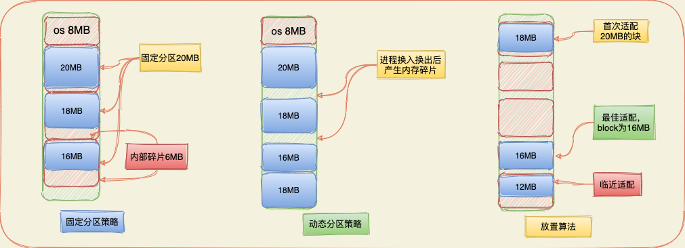
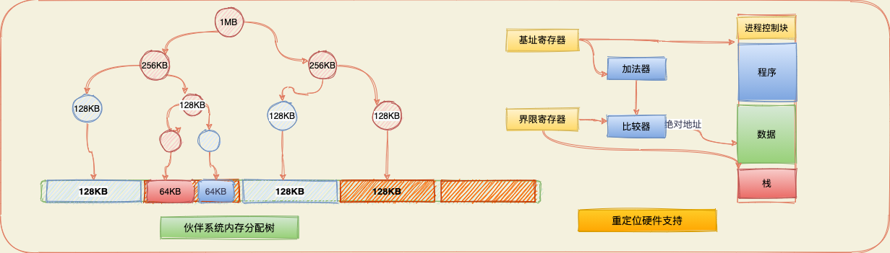
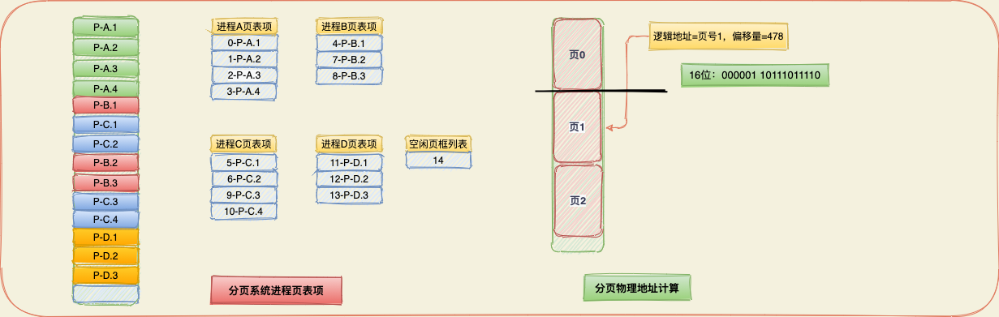

# 内存管理

> 在单道程序设计系统中，内存被划分成两部分：一部分供操作系统使用（驻留监控程序、内核），一部分供当前正在执行的程序使用。在多道程序设计系统中，必须在内存中进一步细分出“用户”部分，以满足多个进程的要求。细分的任务由操作系统动态完成，这称为内存管理。

内存管理相关术语：
| 页框 | 内存中一个固定长度的块                                       |
| ---- | :----------------------------------------------------------- |
| 页   | 一个固定长度的数据块，存储在二级存储器中（如磁盘），数据页可以临时复制入内存中的页框中 |
| 段   | 一个变长的数据块，存储在二级存储器中。整个段可以临时复制到内存的一个可用区域内（分段），或者可以将一个段分为许多页，将每页单独复制到内存中（分段与分页相结合） |

## 1. 内存管理的需求

当研究与内存管理相关的各种机制和策略时，清楚内存管理要满足的要求是非常有用的。`[LIST93]`对内存管理提出了`5`点需求：重定位、保护、共享、逻辑组织、物理组织。

1. **重定位**：在多道程序设计系统中，可用的内存空间通常被多个进程共享。通常情况下，程序员并不能事先知道在某个程序执行期间会有其他哪些程序驻留在内存中。当程序被换出到磁盘，在下一次进程被重新换入内存时，需要重新定位数据的起始位置。执行程序时，处理器硬件和操作系统软件必须能够通过某种方式把程序代码中的内存访问换成实际的物理内存地址，并反映程序在内存中的当前位置。
2. **保护**：每个进程都应该受到保护，以免被其他进程有意或无意得干涉。由于程序在内存中的位置是不可预测的，因而在编译时不可能检查绝对地址来确保保护。并且大多数程序语言允许在运行时进程地址的动态计算（例如，通过计算数组下标或者数据结构中的指针）。用户进程不能访问操作系统的任何部分，不论程序还是数据。内存保护的需求必须由处理器（硬件）来满足。
3. **共享**：任何保护机制都必须具有一定的灵活性，以允许多个进程访问内存的同一部分。合作完成同一个任务的进程可能需要共享访问相同的数据结构。
4. **逻辑组织**：计算机系统中的内存总是被组织成线性的（或者一维的）地址空间，并且地址空间是由一系列字节或字组成的。外部存储器在物理层上也是按类似方式组织的。可以独立得编写和编译模块，系统在运行时解析从一个模块到另一个模块的所有引用。通过适度的额外开销，可以引入某种机制，使得模块可以被多个线程共享。
5. **物理组织**：计算机存储器至少要被组织成两级，称为内存和外存。内存提供快速的访问，成本也相对比较高。并且内存是易失的。外存比内存更便宜，它通常是非易失性的。在这种两级方案中，系统主要关注的是内存和外存之间信息流的组织。

## 2. 内存分区策略

内存管理最基本的操作是由处理器把程序装入内存中执行。在大部分现代多道程序设计系统中，这往往还涉及一种称之为虚拟内存的精密方案。虚拟内存又基于分段和分页这两种基本技术或其中的一种。在考虑虚拟内存技术前，先考虑一些不涉及虚拟内存的简单技术：固定分区、动态分区、伙伴系统和重定位技术。

**1. 固定分区**：固定分区的两种选择，一种是使用大小相等的分区。在这种情况下，小于或等于分区大小的任何进程都可以装入到任何可用的分区中。若所有的分区都装满了，并且没有进程处于就绪或运行态，则操作系统可以换出一个进程的所有分区，并装入另一个进程。

**固定分区的难点**：1）程序可能太大而不能放到一个分区中，在这种情况下，程序员必须使用覆盖技术设计程序。在任何时候，该程序只有一部分需要放在内存中。当需要的模块不在时，用户程序必须把这个模块装入到程序的分区中，覆盖该分区的任何程序和数据。2）内存利用率非常低。任何程序，即使很小都需要占据一个完整的分区，在`8MB`的分区装入`2MB`的程序产生了内存碎片（`6MB`空间浪费）。

**2. 动态分区**：对于动态分区，分区的长度和数目是可变的，当进程被装入内存时，系统会给它分配一个块和它所需容量完全相等的内存空间。动态分区方法在开始时是很好的，但它最终会导致在内存中出现许多小的空洞。随着时间的推移，内存中产生了越来越多的内存碎片，内存的利用率随之下降。这种现象称为外部碎片（`external fragmentation`）。克服外部碎片的一种技术是压缩，操作系统不时的移动进程，使得进程占据的空间连续，并且所有空闲空间连成一片。

**动态分区放置算法**：最佳适配、首次适配和下次适配。这三种算法都是在内存中选择等于或大于该进程的空间块。差别在于：最佳适配选择与要求的大小最接近的块；首次适配从头开始扫描，选择大小足够的第一个可用块；下次适配从上一次放置的位置开始扫描内存，选择下一个大小足够的可用块。

**3.伙伴系统**：在伙伴系统中，会将原有空闲内存大小进行等分，如果等分后的伙伴仍然大于申请的内存，则继续进行等分，直到空间符合最小满足要求。当分配的内存空间使用完后，若列表中一对伙伴都变成未分配的块时，它们会从列表中释出，合并成一个新的块。

**4.重定位**：在分区策略中当有进程被换入换出时，其会占用两个不同的内存区域。此外，在进行压缩时，内存中的进程也可能会发生移动。因此，进程访问的（指令和数据单元的）位置不是固定的。当进程被换入或在内存中移动时，指令和数据单元的位置会发生改变。需要一个硬件机制把相对地址转换为物理内存地址。

## 2. 分页和分段

大小不等的固定分区和大小可变的分区技术在内存的使用上都是低效的，前者会产生内部碎片，后者会产生外部碎片。但是，加入内存被划分大小固定相等的块，且块相对比较小，每个进程也被分成同样大小的小块，那么进程中称为页的块可以指定到内存中称为页框的可用块。使用分页技术在内存中为每个进程浪费的空间仅仅是进程最后一页的一小部分形成的内部碎片，没有任何外部碎片。

采用分页技术的分区相当小，一个程序可以占据多个分区，并且这些分区不需要是连续的。操作系统为每个分区维护一个页表，页表中给出了该进程的每一页对应的页框的位置。在程序中，每个逻辑地址包括一个页号和在该页中的偏移量。在简单分区中，逻辑地址是一个字相对于程序开始处的位置，处理器把它转换称一个物理地址。

细分用户程序的另一个另一种可选方案是分段。采用分段技术，可以把程序和其相关的数据划分到几个段中。采用大小不相等的段的另一个结果是，逻辑地址和物理地址间不再具有简单的对应关系。类似于分页，在简单的分段方案中，每个进程都有一个段表。系统也会维护一个内存中的空闲块列表，每个段表项必须给出相应的段在内存中的起始位置。系统会把其段表的地址装载到一个寄存器中，由内存管理硬件来使用这个寄存器，考虑一个`m+n`位的地址，最左边的`n`位是段号，最右边的`m`位是偏移量，物理地址计算如下：

1） 提取段号，即逻辑地址最左边的`n`位。

2）以这个段号为索引，查找该进程段表中该段的起始物理地址。

3）最右边`m`位表示偏移量，偏移量和段长度进行比较，如果偏移量大于该段的长度，则这个地址无效。

4）物理地址为该段的起始物理地址与偏移量之和。

## Q&A 复习题

1. 内存管理需要满足哪些要求？

   答：重定位、保护、共享、逻辑组织、物理组织。

2. 为什么需要重定位进程的能力？

   答：通常，程序员在执行程序时不可能事先知道哪些其它程序将驻留在主存储器。另外，我们希望能够通过提供大

   量准备执行的进程来在主存中交换活动进程，从而在最大程度上利用处理器。在这两种情况下，进程在主内存中的特

   定位置都是不可预测的。

3. 为什么不可能在编译时实时内存保护？

   答：由于程序在主存储器中位置是不可预测的，因此，无法在编译时检查绝对地址以确保保护。此外，大多数编程语言

   都允许在运行时计算地址，例如通过计算数组下标或数据结构中的指针。因此，必须在运行时检查由进程生成的所有内

   存引用，以确保它们仅引用分配给该进程的内存空间。

4. 允许两个或多个进程访问内存某一特定区域的原因是什么？

   答：如果多个进程正在执行同一程序，则允许每个进程访问程序的同一副本而不是拥有自己单独的副本。同样，在某些任

   务上进行协作的进程可能需要共享对同一数据结构的访问。

5. 在固定分区方案中，使用大小不相等的分区有什么好处？

   答：通过使用大小不相等的固定分区：1. 可以提供一个或两个相当大的分区，但仍然有大量的分区。大分区可以允许整个

   加载大程序。2.减少内部碎片，因为可以将一个小程序放入一个小分区中。

6. 内部碎片和外部碎片有什么区别？

   答：内部碎片是指分区内浪费的空间，这是因为加载的数据块小于分区。外部碎片是与动态分区相关的一种现象，指的

   是任何外部的大量主内存小区域会累积的事实。

7. 逻辑地址、相对地址和物理地址有什么区别？

   答：逻辑地址是对存储位置的引用，而与对数据的当前分配无关。必须先对物理地址进行转换，然后才能实现内存访问。

   相对地址是逻辑地址的特定示例，其中该地址表示为相对于某个已知点的（通常是程序的开始）位置。物理地址或绝地

   地址是主内存中实际位置。

8. 页和页框之间有什么区别？

   答：在分页系统中，程序和数据存储在磁盘上或分为相等的固定大小的块（称为页面），主存储器分为相同大小的块（称为

   帧），一页可以恰好容纳一帧。

9. 页和段之间有什么区别？

   答：细分用户程序的另一种方法是分段，在这种情况下，程序及其相关数据分为多个段。尽管有最大的段长度，但是不需

   要所有程序的所有段都具有相同的长度。

