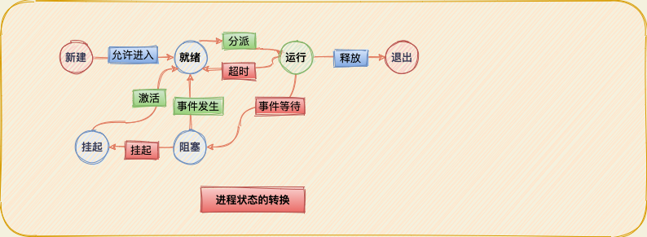

# 进程描述和控制

> 操作系统的设计必须反映某些一般性的要求。所有的多道程序操作系统，从诸如`Windows 98`的用户系统到`IBM z/OS`的可支持成千上万个用户的主机系统，它们的创建都围绕着进程的概念：操作系统必须交替执行多个进程，在合理的响应时间范围内使处理器的利用率最大。操作系统必须按照特定的策略（优先级）给进程分配资源，同时避免死锁。操作系统可以支持进程间的通信和用户创建进程，它们对构造应用程序很有帮助。

## 1. 什么是进程

之前给进程下了如下定义：

* 正在执行的程序。
* 正在计算机上执行的程序实例。
* 能分配给处理器并由处理器执行的实体。
* 具有以下特征的活动单元：一组执行序列的执行、一个当前状态和相关的系统资源集。

也可以把进程当成由一组元素组成的实体，进程的两个基本的元素是程序代码和代码关联的数据集。假设处理器开始执行这个程序代码，且我们把这个执行实体叫做进程。在进程执行时，任意给定一个时间，进程都可以唯一地被表征为以下元素：

* 标识符：跟这个进程相关的唯一标识符，用来区别其他进程。
* 状态：如果进程正在执行，那么进程处于运行态。
* 优先级：相对于其他进程的优先级。
* 程序计数器：程序中即将被执行的下一条指令的地址。
* 内存指针：包括程序代码和进程相关数据的指针，还有和其他进程共享内存块的指针。
* 上下文数据：进程执行时处理器和寄存器中的数据。
* `I/O`状态信息：包括显示的`I/O`请求、分配给进程的`I/O`设备（例如磁带驱动器）和被进程使用的文件列表等。
* 记账信息：可能包括处理器时间总和、使用的时钟总和、时间限制、记账号等。

前述的信息放在一个进程控制块中的数据结构中，该控制块由操作系统创建和管理。进程控制块包含了充分的信息，这样就可以中断一个进程的执行，并且在后来恢复执行进程时就好像进程未被中断过。

## 2.进程状态

队列是"先进先出"的表，对于可运行的进程处理器以一种轮转的方式操作（依次给队列中的每个进程一定的执行时间，然后进程返回队列，阻塞情况除外）。因此，如果使用单个队列，分派器不能只考虑选择队列中最老的进程，相反，它应该扫描这个列表，查找那些未被阻塞且在队列中时间最长的进程。

解决这中情况的一种比较自然的方法是将非运行状态分成两个状态：就绪和阻塞，此外还应该另外增加两个已经证明很有用的状态。新图中的`5`个状态如下：

* 运行态：该进程正在执行。假设计算机只有一个处理器，因此一次最多只有一个进程处于这个状态。
* 就绪态：进程做好了准备，只要有机会就开始执行。
* 阻塞/等待态：进程在某些事件发生前不能执行，如`I/O`操作完成。
* 新建态：刚刚创建的进程，操作系统还没有把它加入到可执行进程组中。通常是进程控制块已经创建但还没有加载到内存中的新进程。
* 退出态：操作系统从可执行进程组中释放出的进程，或者是因为它自身停止了，或者是因为某种原因而被取消。

由于`I/O`活动比计算速度慢很多，因此在单道程序系统中的处理器在大多数时候是空闲的。一种解决方法是内存可以被扩充以适应更多的进程，但是这种方法有两个缺陷：首先是价格问题，当内存大小增加到兆位及千兆位时，价格也会随之增加。再者，程序对内存空间需要的增长速度比内存价格下降的速度快。这样往往会导致更大的进程，而不是更多的进程。

另一种解决方案是交换，包括把内存中某个进程的一部分或全部移到磁盘中。当内存中没有处于就绪状态的进程时，操作系统就把阻塞的进程换出到磁盘中的"挂起队列"。这是暂时保存从内存中被"驱逐"出的进程队列，或着说是被挂起的进程队列。操作系统在此之后取出挂起队列中的另一个进程，或者接受一个新进程的请求，将其纳入内存运行。

* 阻塞/挂起态：进程在外存汇总并等待一个事件。
* 就绪/挂起态：进程在外存中，但是只要被载入内存就可以执行。

## 3.进程控制

非特权态常称作用户态，这是因为用户程序通常在该模式下运行；特权态可称作系统态、控制态或内核态，内核态指的是操作系统的内核，这是操作系统中包含最重要系统功能的部分。

使用两种模式的原因是很显然的，它可以保护操作系统和重要的操作系统表（如进程控制块）不受用户程序的干涉。在内核态下，软件具有对处理器以及所有指令、寄存器和内存的控制能力，这一级的控制对用户程序不是必需的。

**进程切换**：进程切换可以在操作系统从当前正在运行的进程中获得控制权的任何时刻发生。首先考虑系统中断，实际上，大多数操作系统区分两种类型的系统中断。一种称为中断，另一种称为陷阱。常见的场景如下：

* 时钟中断：操作系统确定当前正在运行的进程的执行时间是否已经超过了最大允许时间段（时间片，即进程在被中断前就可以执行的最大时间段），如果超过了，进程必须切换到就绪态，调入另一个进程。
* `I/O`中断：操作系统确定是否发生了`I/O`活动，如果`I/O`活动是一个或多个进程正在等待的事件，操作系统就把所有相应的阻塞态进程转换到就绪态。
* 内存失效：处理器访问一个虚拟内存地址，且此地址单元不在内存中时，操作系统必须从外存中把包含这个引用的内存块（页或段）调入内存中。在发出调入内存块的`I/O`请求之后，操作系统可能会执行一个进程切换，以恢复另一个进程的执行，发生内存失效的进程被置为阻塞态，当想要的块被掉入内存中时，该进程被置为就绪态。

## 4.Q&A 复习题

1. 什么是指令跟踪？

   答：指令跟踪对应用来说是一系列用于执行的指令。

2. 通常有哪些事件会导致创建一个进程？

   答：新的批处理作业、交互登录、操作系统因为提供一项服务而创建、由现有进程派生。

3. 对于`3.6`的进程模型，请简单定义每个状态？

   答：`Running`进程正在被执行、`Ready`等待执行，当有调度会执行、`Blocked`进程阻塞直到`event`发生、`new`进程被创建但未放入任务池中、`Exited`进程被`OS`释放，因为完成或其他一些原因`halted`。

4. 抢占一个进程是什么意思？

   答：一个正在执行的进程被`processor`中止，这样另一个进程才可以执行。

5. 什么是交换，其目的是什么？

   答：`swap`指移动力`part or all process`从内存到`disk`，当内存中没有`ready`的进程。`OS`将其中一个`blocked`的进程写出到`disk`。放入到一个挂起的`queue`中，这样，其它进程可被带入主存执行。

6. 为什么图`3.9`中有两个阻塞态？

   答：有两个独立的概念，当进程等待时间发生时或者`main memory`不足时被换出。

7. 列出挂起进程的`4`个特点。

   答：进程不能立即执行：进程可能是正在等待一个事件，为阻止进程执行。可以通过代理把这个进程置于挂起状态，代理为进程自己或子进程。除非代理显示地命令进行状态转换，否则进程无法转移。

8. 对于哪类试题，操作系统为了管理它而维护其信息表？

   答：`os`维护内存、`I/O`、文件及进程数据。

9. 列出进程控制块中的三类信息。

   答：进程标识符、处理器状态信息、进程控制信息。

10. 为什么需要两种模式（用户态和内核态）？

    答：用于保护`OS`被破坏，在内核模式下，操作系统没有这些限制，因而它可以执行其任务。

11. 操作系统创建一个新进程所执行的步骤是什么？

    答：进程创建：1）给新进程分配一个进程标识符；2）给进程分配空间；3）初始化进程控制块；4）设置正确的连接；5）创建或扩充其他数据结构。

12. 中断和陷阱有什么区别？

    答：中断是由于某种事件造成的，该事件在当前正在运行的进程外部并与之无关，例如`I/O`操作的完成。陷阱与当前正在运行的进程有关，例如非法文件访问尝试。

13. 举出中断的三个例子。

    答：时钟中断：`cpu`分配的时间片用完，`I/O`中断-操作系统确定是否发生`i/o`活动，内存失效-处理器访问虚拟内存时不存在，其从外存进行加载发生缺页中断。

14. 模式切换和进程切换有什么区别？

    答：模式切换发生并不需要改变进程的状态（运行态），进程切换涉及将当前正在执行的进程从"运行"中移除，而转向另一个进程，设计保存更多的状态信息。