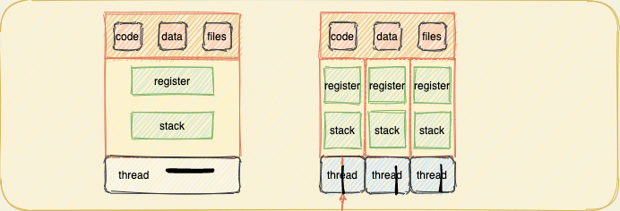
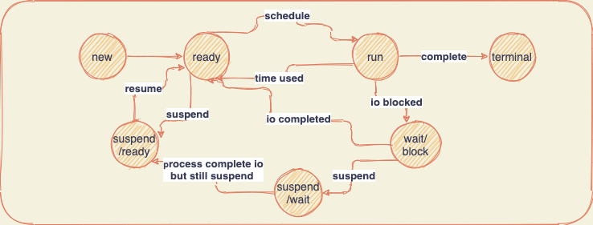

# 线程、对称多处理（SMP）和微内核

> 一些与进程管理相关的更高级的概念：一个与资源所有权相关，一个与执行相关。在许多操作系统中出现并发展了称为线程的结构。在分析线程之后，接下来是对称多处理（SMP）情况下，操作系统必须能够同时在多个处理器上调度不同的进程。最后为微内核概念，它是构造操作系统以支持进程管理及相关任务的一种有效方法。

## 1. 进程与线程

到目前为止提出的进程的概念包括两个特点，很多操作系统能够独立的处理。为了区分，分派的单位通常称做线程或轻量级进程，而拥有资源所有权的单位通常仍称做进程或任务：

1. **资源所有权**：一个进程包括一个存放进程映像的虚拟地址空间，进程映像是程序、数据、栈和进程控制块中定义的属性的集合。一个进程总是拥有对资源的控制或所有权，这些资源包括内存、I/O通道、I/O设备和文件。操作系统执行保护功能，以防止进程之间发生不必要的与资源相关的冲突。
2. **调度/执行**：一个进程沿着一个或者多个程序的一条路径执行，其执行过程可能与其它进程的执行过程交替进行（cpu时间片用完、IO阻塞等）。因此，一个进程具有一个执行状态（运行、就绪等）和一个分配的优先级，并且是一个可被操作系统调度和分派的实体。



多线程是指操作系统在单个进程内支持多个并发执行路径，每个进程中只有一个线程在执行的传统方法称为单线程方法。在一个进程中可能有一个或多个线程，每个线程具有：线程执行状态（运行、就绪等）、在未运行时保存的线程上下文、执行栈、用于每个线程局部变量的静态存储空间、与进程内的其他线程共享对进程的内存和资源的访问。

进程与线程的区别：在单线程进程模型中，进程包括它的进程控制块和用户地址空间，以及在进程执行中管理调用/返回行为的用户栈和内核栈。进程中每个线程都有一个独立的栈，还有独立的控制块用于包含寄存器值、优先级和其他线程相关的状态。进程中的所有线程共享该进程的状态和资源，它们驻留在同一块地址空间中，并且可以访问相同的数据。

**从性能分析线程的优点**：1）在进程中创建一个新线程要比新进程花费更少时间，同时终止也更轻量级操作。2）同一进程内线程间切换要比进程间切换容易。3）在线程间的通信效率更高，由于共享相同进程控制块和用户地址空间。而进程间的通信则需要依赖于操作系统内核。

**用户级和内核级线程**：在纯粹的线程级软件中，线程管理的所有工作都由应用程序完成，内核意识不到线程的存在。线程切换的上下文包括用户寄存器的内容、程序计数器和栈指针。用户级线程优点：1）由于线程管理的数据结构都在一个进程的用户地址空间，线程切换不需要内核特权，节省了两次状态转换的开销。2）调度可以是应用程序相关，可以做到为应用程序量身定做算法。3）用户级线程可在任何操作系统运行，不需要对底层内核进行修改以支持用户级线程。内核级线程，内核为进城及内部的每个线程维护上下文信息，调度由内核基于线程完成。

## 2.对称多处理 

处理器通过按顺序逐条地执行机器指令来执行程序，每条指令是以操作序列（取指、取操作数、执行操作、存储结构）的方式执行的。SMP系统组织结构：SMP中有多个处理器，每个都含有它自己的控制单元、算数逻辑单元和存储器；每个处理器都可以通过某种形式的互连机制访问一个共享内存和I/O设备；共享总线就是一个通用方法，处理器可以通过内存（留在共享地址空间中的消息和状态信息）互相通信，还可以直接交换信号。

**进程对象和线程对象**：进程是对应一个拥有内存、打开的文件等资源的用户作业或应用程序的实体；线程是顺序执行的一个可分派的工作单元，并且它是可中断的。同一个进程中的多个线程可以分配给不同的处理器并且同时执行，一个含有多线程的进程在实现并发时，不需要使用多进程的开销。同一个进程中的线程可以通过它们的公共地址空间交换信息，并访问进程中的共享资源，不同进程中的线程可以通过在两个进程间建立的共享内存交换信息。



一个存在于系统中的线程处于以下状态：***就绪态*** 可以被调度执行，内核分派器跟踪所有就绪线程，按优先级顺序进行调度。***备用态*** 备用线程已被选择下一次在一个特定处理器上运行，该线程处于在这个状态等待 直到cpu处理器可用。***运行态*** 一旦内核分派处理器执行了线程切换，备用线程将进入运行状态并开始执行。执行过程一直持续到该线程被抢占、用完时间片、被阻塞或终止。***等待态*** 当线程被一个事件（如IO阻塞）、为了同步自愿等待或者一个环境子系统指引它把自身挂起时。***过渡态***一个线程在等待后，若准备好运行单资源部可用时，进入该状态。***终止态*** 一个线程被另一个线程终止，或者它的父进程终止时终止。一旦完成清理工作，该线程从系统中移出。

## 3.Linux的进程和线程管理

linux中的集成或任务由一个`task_struct`数据结构表示，这个`task_struct`结构包含以下信息：

* 状态：进程的执行状态（执行态、就绪态、挂起态、停止态、僵死态）；
* 调度信息：`linux`调度进程所需要的信息。一个进程可能是普通的或实时的，并且具有优先级。实时进程在普通进程前被调度，并且在每一类中使用相关的优先级；
* 标识符：每个进程有一个唯一的进程标识符，还有用户标识符和组标识符，组标识符用于给一组进程指定资源的访问权限；
* 进程间通信：`linux`支持`Unix SVR4`中的`IPC`通信机制；
* 链接：每个进程都有一个到它的父进程的链接及到它的兄弟进程（与它有相同的父进程）的链接和所有子进程的链接；
* 时间和计时器：包括进程创建的时刻和进程所消耗的处理器时间总量。一个进程可能还有一个活多个间隔计时器，它通过系统调用定义间隔计时器。以及文件系统、地址空间、处理器专用上下文、运行以及是否可中断；

## Q&A 复习题及习题

1. 表`3.5`列出了在一个没有线程的操作系统中进程控制块的基本元素，对于多线程系统，哪些可能是属于线程控制块，哪些可能属于进程控制块？

   ```
   答：在系统之间会有所不同，但是通常，资源归进程所有，并且每个线程都有其自己的执行状态。关于表3.5中每个类别的一些一般性评论，
   标识：必须标识进程，但是进程中的每个线程都有自己的id。处理器状态信息：这些通常与过程有关。流程控制信息：调度和状态信息主要
   位于线程级别，数据结构可能出现在两个层面上，可以同时支持进程间通信和线程间通信。特权可能同时存在于两个级别，内存管理通常
   在进程级别；资源管理通常在进程级别；
   ```

2. 线程间的状态切换比进程间的状态切换开销更低的原因？

   ```
   答：涉及更少的状态信息。
   ```

3. 在进程概念中体现出的两个独立且无关的特点是什么？

   ```
   答：资源的拥有权和调度执行。
   ```

4. 给出在单用户多处理器系统中使用线程的4个例子？

   ```
   答：前台和后台工作、异步处理、执行速度、模块化程序结构。
   ```

5. 哪些资源通常被一个进程中的所有线程共享？

   ```
   答：地址空间、文件资源及执行权限。
   ```

6. 列出用户级线程相对于内核级线程的`3`个优点？

   ```
   答：1）线程切换不需要内核模式特权，因为所有线程管理的数据结构都在单个进程的用户地址空间。因此，该进程不会切换到内核模式来执行线
   程管理。这样可以节省两个模式切换的开销（用户到內核、内核到用户）；2）调度可以是特定于应用程序的。一个应用程序可能受益于循环调度
   算法，而另一个应用程序可能受益于优先级的调度算法。可以针对应用程序量身定制调度算法，而不会打扰底层的OS调度程序。3）UTL可以在任
   何操作系统上运行，无需更改基础内核即可支持UTL。线程库是所有应用程序共享的一组应用程序级实用程序。
   ```

7. 列出用户级线程相对于内核级线程的两个缺点？

   ```
   答：1)在典型的操作系统中，许多操作系统处于阻塞状态。因此，当UTL执行系统调用时，不仅该线程被阻塞，而且进程內的所有线程也被阻塞。
   2）在纯UTL策略中，多线程应用程序无法利用多处理功能。内核一次只能将一个进程分配一个处理器，因此，一次只能在一个进程中执行一个线程。
   ```

8. 定义`jacketing`。

   ```
   答：jacketing通过使用应用程序I/O例程（将I/O设备的状态）将阻塞调用转换为非阻塞调用。
   ```

9. 简单定义图`4.8`中列出的各种体系结构。

   ```
   答：SIMD:单个机器指令以锁步为基础控制多个处理元素的同时执行，每个处理都有一个关联的数据存储器，因此每个指令由不同的处理器在一组
   不同的数据执行。MIMD 一组处理器同时对不同数据集执行不同的指令序列。 Master/Slave: 操作系统内核使用在特定处理器上运行，其他处
   理器可能执行用户程序，可能还执行操作系统实用程序。SMP：内核可以在任何处理器上执行，并且通常每个处理器都会从可用进程或线程池中进行
   自我调度。Cluster：每个处理器都有一个专用内存，并且是一台独立的计算机。
   ```

10. 列出`SMP`操作系统的主要设计问题。

    ```
    答：同时并发进程或线程，进程同步内存管理能力，可靠性和容错能力。
    ```

11. 给出在典型的单体结构操作系统中可以找到，且可能是微内核操作系统外部子系统的服务和功能。

    ```
    答：设备驱动、文件系统、虚拟内存管理、窗口系统及安全服务。
    ```

12. 列出并简单解释为内核设计相对于整体式结构设计的`7`个优点？

    ```
    答：统一接口，进程不必区分内核级和用户级服务，因为所有此类服务都是通过消息传递提供的。可扩展性，促进新服务的添加以及在同一功能区
    域中提供多种服务。灵活性，不仅可以将新功能添加到操作系统，而且可以减去现有功能以产生更小，更有效的实现。可移植性，所有或至少许多
    特定于处理器的代码都在微内核中；因此，将系统移植到新处理器所需的更改较少，并且倾向于按逻辑分组进行排列。可靠性，可以对小型微内核
    进行严格测试，它使用少量的应用程序编程接口（API）可以提高为内核外部的操作系统服务生成高质量代码的机会。 
    分布式系统支持：微内核通信的消息定向使其可以扩展到分布式系统。支持面向对象的操作系统（OOOS）：面向对象的方法可以为微内核的设计和
    对操作系统的模块化扩展的开发提供约束。
    ```

13. 解释微内核操作系统可能存在的性能缺陷？

    ```
    答：与进行单个服务调用相比，通过微内核构建和发送消息以及接受和解码回复所需的时间更长。
    ```

14. 列出即使在最小微内核操作系统中也可以找到的3个功能。

    ```
    答：这些功能属于低级内存管理、进程间通信（IPC）以及I/O和中断管理的一般类型。
    ```

15. 在微内核操作系统中，进程或者线程间通信的基本形式是什么？

    ```
    答：消息。
    ```

    

    

    

    

    

    

