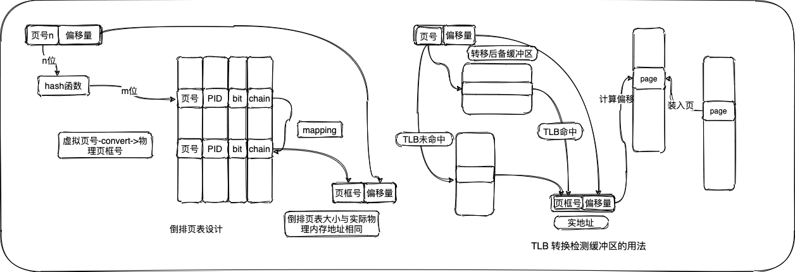
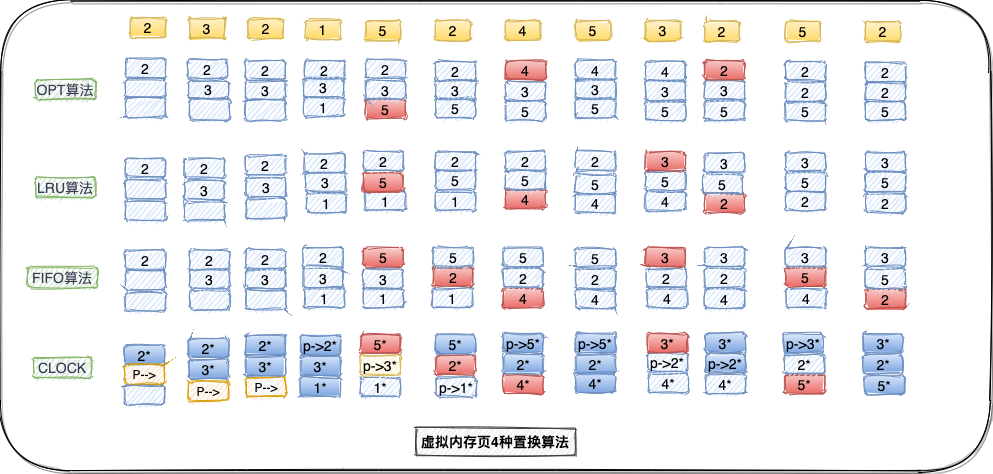

# 虚拟内存

> 在存储分配机制中，尽管备用内存是主存的一部分，它也可以被寻址。程序引用内存使用的地址与内存系统用于识别物理存储站点的地址是不同的，程序生成的地址会自动转换成机器地址。虚拟存储的大小受到计算机系统寻址机制和可用的备用内存量的限制，而不受内存存储实际数量的限制。

虚拟内存术语表：

| 虚拟地址     | 在虚拟内存中分配给某一位置的地址使该位置可以被访问，仿佛它是主内存的一部分 |
| ------------ | ------------------------------------------------------------ |
| 虚拟地址空间 | 分配给进程的虚拟存储                                         |
| 地址空间     | 可用于某进程的内存地址范围                                   |
| 实地址       | 内存中存储位置的地址                                         |

## 硬件和控制结构

分段和分页相比较于固定分区、动态分区的特点在于：1）进程中的所有存储器访问的都是逻辑地址，逻辑地址在运行时动态地被转换成物理地址。这使得一个进程可以被换入换出内存，进程可以在执行过程中的不同时刻占据内存的不同区域。2）一个进程可以划分成许多块（页和段）在执行过程中，通过页表（段表）允许进程的这些块不在连续的内存中。当具备这两个特点，那么在进程的执行过程中，该进程不需要所有页或者所有段都在内存中。

假设需要把一个新进程放入内存时，操作系统仅读区包含程序开始处的一个或几个块，进程执行的任何时候都在内存中的部分被定义成进程的常驻集`（resident set）`。如果处理器需要访问一个不在内存中的逻辑地址，则产生一个中断，说明产生了内存访问故障。操作系统把被中断的进程置为阻塞态，并取得控制。为了能继续执行这个进程，操作系统产生一个磁盘`I/O`读请求用于将需要的块加载到内存中，操作系统将把由于缺少该块而被阻塞的进程置回就绪态。操作系统仅因为数据缺失产生了中断，这种方法的`cpu`利用率问题很让人怀疑。有两种实现方法可以提高系统利用率，这两种实现方法分别是：

* 1）在内存中保留多个进程，由于对任何特定进程只装入它的某些块，因此就有足够的空间来放置更多的进程。这样，任何时刻都至少能有一个处于就绪状态，于是处理器得到了更有效的利用；
* 2）进程可以比内存的全部空间还大。由于一个进程只能在内存中执行，因此这个存储器称为实存储器`（real memory）`，简称实存。程序员或用户感觉到的是一个更大的内存，通常它被分配在磁盘上，这称为虚拟内存`（virtual memory）`。虚存分页、虚存分段的特点在于并不是它的所有页都必须在内存页框中，只在需要时才读入页。

任何一个进程只有一部分块位于内存中，可以在内存中保留更多的进程。在理想情况下，几乎内存的所有空间都被进程块占据，处理器和操作系统可以直接访问到尽可能多的进程。但是，操作系统必须很"聪明"地管理这个方案。局部性原理描述了一个进程中程序和数据引用的集簇倾向，因此，假设在很短的时间内仅需要进程的一部分是合理的。同时，还可以对在不远的将来可能会访问的块进行猜测，从而避免系统抖动。

### 分页、分段及段页式设计

术语虚拟内存通常与使用分页的系统联系在一起，第一个使用分页实现虚拟内存的是`Altas`计算机[KILB62]，随后很快广泛用于商业用途。在分页系统中，每个进程都有自己的页表。页表项（`Page Table Entry`，简称`PTE`）包含有与内存中的页框相对应的页框号。考虑基于分页的虚拟内存方案时也同样需要页表，由于一个进程可能只有一些页在内存中，因而每个页表项需要有一位（`P`）来表示它所对应的页当前是否在内存中。如果这一位表示该页在内存中，则这个页表项还包括该页的页框号。页表项中所需要的另一个控制位是修改位（`M`）,表示相应页的内容从上一次装入内存到现在是否已经改变。

**页表结构及地址转换**：从存储器中读区一个字的基本机制包括使用页表从虚拟地址到物理地址的转换，虚拟地址又称为逻辑地址，由页号和偏移量组成，而物理地址由页框号和偏移量组成。在`VAX`系统中若每个页大小位`512`字节，这意味着每个进程需要有`2^22`个页表项。显然，采用这种方法用于放置页表的内存空间实在太多了，为了克服这个问题，大多数虚拟内存方案都在虚拟内存中而不是在实内存中保存页表。

针对页表项较多的问题，有一种用于`32`位地址的两级方案的典型例子。假设采用字节级的寻址，页尺寸为`4KB`。那么`4GB`的虚拟地址空间由`2^20`页组成。如果这些页中的每一个都由一个`4`字节的页表项映射，则可以创建一个由`2^10`个页表项组成的页表，这时根页表需要`4KB`的内存。根据用户页表的页表项找到页面，如果该页不在内存中，则发生一次缺页中断。

**倒排页表**：段页式页表设计的一个重要缺陷是页表的大小与虚拟地址空间的大小成正比，使用一级或多级页表的一种替代方法是使用一个倒排页表结构，该方法的各种变种用于`PowerPC`、`UltraSPARC`和`IA-64`体系结构中。在这种方法中，虚拟地址的页号部分使用一个简单的散列函数映射到散列表中。散列表包含一个指向倒排表的指针，而倒排表中含有页表项。通过这个结构，散列表和倒排表中各有一项对应于一个实存页，而不是虚拟页。页表的结构称为"倒排"是因为它使用页框号而不是虚拟页号来索引页表项。

在一个倒排页表典型实现中，对于大小为`2^m`个页框的物理内存，倒排页表包含`2^m`项，所以第`i`个项对应第`i`个页框。页表中的每项都包含如下内容：页号，虚拟地址的页号部分；进程标识符，使用该页的进程，页号和进程标志符结合起来标志一个特定进程的虚拟地址空间的一页；控制位，该域包含一些标记，比如有效、访问和修改，以及保护和锁定信息；链指针，如果某个项没有链项，则该域为空（或许用一个单独的位来表示）。否则，该域包含链中下一项的索引值。

**转换检测缓冲区**：原则上，每个虚拟访问可能引起两次物理内存访问：一次取相应的页表项，一次取需要的数据。因此，简单的虚拟内存方案会导致存储器访问时间加倍。为克服这个问题，大多数虚拟内存方案为页表项使用一个特殊的高速缓存，通常称之为转换检测缓冲区`（Translation Lookaside Buffer, TLB）`。这个高速缓存的功能和高速缓冲存储器相似，包含最近用过的页表项。给定一个虚拟地址，处理器首先检查`TLB`，如果需要的页表项在其中（`TLB`命中），则检测页框号并形成实地址，否则将产生一次存储器访问故障，称为缺页`（page fault）`中断。

页尺寸是一个重要的硬件设计决策，需要考虑多方面的因素。页尺寸的设计问题与物理内存的大小和程序大小有关。当内存变大时，应用程序使用的地址空间相应的增长，这种趋势在个人计算机和工作站上更为显著。此外，大型程序中所使用的当代程序设计技术可能会降低进程中的局部性。

## 操作系统软件

操作系统的内存管理设计取决于三个基本方面的选择：是否使用虚拟内存技术、使用分页还是分段，或者是二者的结合、为各种存储管理特征采用的算法。读取策略确定一个页何时取入内存，常用的两种方法是请求分页`（demand paging）`和预先分页`(prepaging)`。对于请求分页，只有当访问到某页中的一个单元时才将该页取入内存，其存在如下情况：当一个进程第一次启动时，会在一段时间出现大量的缺页中断；当越来越多的页被取入后，局部性原理表明大多数将来要访问的页都是最近读取。因此，在一段时间后错误会逐渐减少。

对于预先分页，请求的页并不是缺页中断请求的页。预先分页利用了大多数辅存设备（如磁盘）的特性，这些设备有道寻址时间和合理的延迟。如果一个进程的页被连续存储在辅存中，则一次读取许多连续的页比隔一段时间读取一页更有效。当然，如果大多数额外读取的页没有引用到，则这个策略是低效的。

**置换策略**：置换策略在内存管理的各个领域都得到了广泛的研究。当内存中的所有页框都被占据，并且需要读取一个新页以用来处理一次缺页中断时，置换策略决定当前在内存中的哪个页将被置换。目前选择置换页的基本算法包括：最佳`（OPT）`、最近最少使用`(LRU)`、先进先出`(FIFO)`	、时钟策略。

`OPT`策略选择置换下次访问距当前时间最长的那些页，可以看出该算法能导致最少的缺页中断`[BELA66]`，但是由于它要求操作系统必须知道将来的事件，显然这是不可能实现的，但是它仍能作为一种标准来衡量其它算法的性能。

`LRU`策略置换内存中上次使用距离当前最远的页。根据局部性原理，这也是最近最不可能访问到的页。实际上，`LRU`策略的性能接近于`OPT`策略。该方法的问题在于比较难于实现，一种实现方法是给每一页添加一个最后一次访问的时间标签，在每次访问存储器时，都更新这个标签。

`FIFO`策略把分配给进程的页框看做是一个循环缓冲区，按循环方式移动页。它所需要的只是一个指针，这个指针在该进程的页框中循环。因此这是一种实现起来最简单的页面置换策略。

驻留集管理：当代操作系统通常采用两种策略。固定分配策略`（fixed-allocation）`为一个进程在内存中分配固定数目页框用于执行时使用。这个数目是在最初加载时（进程创建时）决定的，可以根据进程的类型（交互、批处理、应用类）或者基于程序员或系统管理员的需要来确定。可变分派策略，允许分配给一个进程的页框在该进程的生命周期中不断得发生变化。

## Q&A 复习题

1. 简单分页与虚拟内存分页有什么区别？

   答：简单分页：除非使用覆盖，否则流程的所有页面都必须位于主存中才能运行流程。虚拟内存分页：并非某个进程的所有页面都需要在主内存帧中才能运行该进程，可以根据需要读取页面。

2. 解释什么是抖动？

   答：抖动是虚拟内存方案中的一种现象，在这种方案中，处理器将大部分时间用于交换段而不是执行指令。

3. 为什么在使用虚拟内存时，局部性原理是至关重要的？

   答：可以设计算法以利用局部性原理来避免抖动。通常，局部性原则允许算法预测哪些驻留页面在不久的将来最不可能被引用，因此是被换出的良好候选者。

4. 哪些元素是页表项中可以典型找到的元素？简单定义每个元素。

   答：帧号，标识主内存中页面的序号；当前位，指示该页面当前是否在主存储器中；修改位，指示该页面自从进入主存储器以来是否已被修改。

5. 转换检测缓冲区的目的是什么？

   答：TLB是一个缓存，其中包含最近使用过的那些页表条目。其目的是在大多数情况下避免必须进入磁盘以检索页表条目的情况。

6. 简单定义两种可供选择的页面读取策略。

   答：对于按需分页，仅当引用该页面某个位置时，该页面才会进入主内存。通过预分页，可以引入除页面错误所需的页面以外的其它页面。

7. 驻留集管理和页面置换策略有什么区别？

   答：驻留集管理处理以下两个问题：1）每个活动进程将分配多少页框架；2）是否应考虑将要替换的页面集限制为导致页面错误或包含主内存中所有页面帧的过程中的页面集。页面替换策略处理以下问题：在所考虑的页面集中，应选择哪个特定的页面集中，应选择哪个特定页面进行替换。

8. FIFO和CLOCK页面置换算法有什么联系？

   答：时钟策略与FIFO类似，不同之处在于时钟策略中，使用位为`1`的任何数据帧均由算法传递。

9. 页缓冲实现的是什么？

   答：1）如果从数据集中取出了一个页面但很快需要使用该页面，则该页面仍位于主内存中，从而节省了读取的磁盘。2）修改后的页面可以一次写入群集，而不是一次写入，从而大大减少了I / O操作的次数，从而减少了磁盘访问时间。

10. 为什么不可能把全局置换策略和固定分配策略组合起来？

    答：由于固定分配策略要求分配给进程的帧数是固定的，因此当需要为进程引入新页面时，必须换出该进程的驻留页面之一（以保持分配的帧数相同），这是本地替换策略。

11. 驻留集和工作集有什么区别？

    答：进程的驻留集是该进程在主内存中的当前页数。流程的工作集是该流程最近被引用的页面数。

12. 请求式清除和预约式清除有什么区别？

    答：使用按需清除时，只有在选择了要替换的页面后，页面才会写到辅助内存中。预清理策略会在需要页框架之前写入修改过的页面，以便可以分批写出页面。

