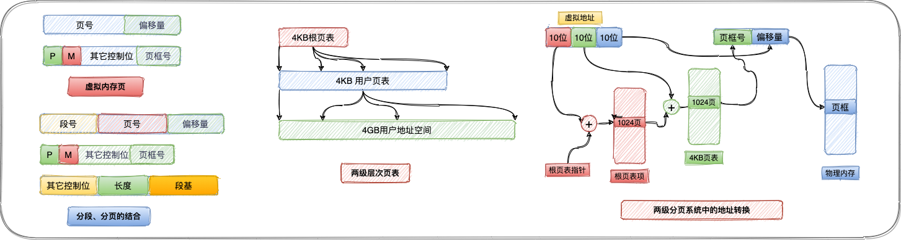

# 虚拟内存

> 在存储分配机制中，尽管备用内存是主存的一部分，它也可以被寻址。程序引用内存使用的地址与内存系统用于识别物理存储站点的地址是不同的，程序生成的地址会自动转换成机器地址。虚拟存储的大小受到计算机系统寻址机制和可用的备用内存量的限制，而不受内存存储实际数量的限制。

虚拟内存术语表：

| 虚拟地址     | 在虚拟内存中分配给某一位置的地址使该位置可以被访问，仿佛它是主内存的一部分 |
| ------------ | ------------------------------------------------------------ |
| 虚拟地址空间 | 分配给进程的虚拟存储                                         |
| 地址空间     | 可用于某进程的内存地址范围                                   |
| 实地址       | 内存中存储位置的地址                                         |

## 硬件和控制结构

分段和分页相比较于固定分区、动态分区的特点在于：1）进程中的所有存储器访问的都是逻辑地址，逻辑地址在运行时动态地被转换成物理地址。这使得一个进程可以被换入换出内存，进程可以在执行过程中的不同时刻占据内存的不同区域。2）一个进程可以划分成许多块（页和段）在执行过程中，通过页表（段表）允许进程的这些块不在连续的内存中。当具备这两个特点，那么在进程的执行过程中，该进程不需要所有页或者所有段都在内存中。

假设需要把一个新进程放入内存时，操作系统仅读区包含程序开始处的一个或几个块，进程执行的任何时候都在内存中的部分被定义成进程的常驻集`（resident set）`。如果处理器需要访问一个不在内存中的逻辑地址，则产生一个中断，说明产生了内存访问故障。操作系统把被中断的进程置为阻塞态，并取得控制。为了能继续执行这个进程，操作系统产生一个磁盘`I/O`读请求用于将需要的块加载到内存中，操作系统将把由于缺少该块而被阻塞的进程置回就绪态。操作系统仅因为数据缺失产生了中断，这种方法的`cpu`利用率问题很让人怀疑。有两种实现方法可以提高系统利用率，这两种实现方法分别是：

* 1）在内存中保留多个进程，由于对任何特定进程只装入它的某些块，因此就有足够的空间来放置更多的进程。这样，任何时刻都至少能有一个处于就绪状态，于是处理器得到了更有效的利用；
* 2）进程可以比内存的全部空间还大。由于一个进程只能在内存中执行，因此这个存储器称为实存储器`（real memory）`，简称实存。程序员或用户感觉到的是一个更大的内存，通常它被分配在磁盘上，这称为虚拟内存`（virtual memory）`。虚存分页、虚存分段的特点在于并不是它的所有页都必须在内存页框中，只在需要时才读入页。

任何一个进程只有一部分块位于内存中，可以在内存中保留更多的进程。在理想情况下，几乎内存的所有空间都被进程块占据，处理器和操作系统可以直接访问到尽可能多的进程。但是，操作系统必须很"聪明"地管理这个方案。局部性原理描述了一个进程中程序和数据引用的集簇倾向，因此，假设在很短的时间内仅需要进程的一部分是合理的。同时，还可以对在不远的将来可能会访问的块进行猜测，从而避免系统抖动。

### 分页、分段及段页式设计

术语虚拟内存通常与使用分页的系统联系在一起，第一个使用分页实现虚拟内存的是`Altas`计算机[KILB62]，随后很快广泛用于商业用途。在分页系统中，每个进程都有自己的页表。页表项（`Page Table Entry`，简称`PTE`）包含有与内存中的页框相对应的页框号。考虑基于分页的虚拟内存方案时也同样需要页表，由于一个进程可能只有一些页在内存中，因而每个页表项需要有一位（`P`）来表示它所对应的页当前是否在内存中。如果这一位表示该页在内存中，则这个页表项还包括该页的页框号。页表项中所需要的另一个控制位是修改位（`M`）,表示相应页的内容从上一次装入内存到现在是否已经改变。

**页表结构及地址转换**：从存储器中读区一个字的基本机制包括使用页表从虚拟地址到物理地址的转换，虚拟地址又称为逻辑地址，由页号和偏移量组成，而物理地址由页框号和偏移量组成。在`VAX`系统中若每个页大小位`512`字节，这意味着每个进程需要有`2^22`个页表项。显然，采用这种方法用于放置页表的内存空间实在太多了，为了克服这个问题，大多数虚拟内存方案都在虚拟内存中而不是在实内存中保存页表。

针对页表项较多的问题，有一种用于`32`位地址的两级方案的典型例子。假设采用字节级的寻址，页尺寸为`4KB`。那么`4GB`的虚拟地址空间由`2^20`页组成。如果这些页中的每一个都由一个`4`字节的页表项映射，则可以创建一个由`2^10`个页表项组成的页表，这时根页表需要`4KB`的内存。根据用户页表的页表项找到页面，如果该页不在内存中，则发生一次缺页中断。

